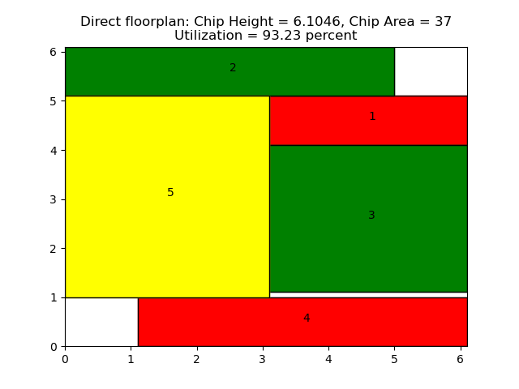

# Optimization of VLSI chip area using Mixed Integer Linear Programming

NOTE: This repository uses the MOSEK library in C++ to solve the problem. Click [here](https://github.com/ShuvoNewaz/MILP-VLSI-Floorplanning-Python/) to view the repository in Python. Aside from the major programming language used, the 2 repositories are identical for all intents and purposes.

This repository is for the Linux operating system and is based on C++11. The visualization uses the [matplotlib](https://matplotlib.org/) library with Python. To use this repository, please follow these steps:

- Clone this repository or download as a zip.
- This project makes use of an LP-solver named MOSEK. The tool can be downloaded and the license can be obtained from [MOSEK's website](https://www.mosek.com/resources/getting-started/). Once registered, follow the instructions regarding the directory setup for MOSEK in the email. In particular, pay attention to the directory where the license file is kept.
- The setup for the MOSEK libraries and header files are dependent on the operating system. For instance, g++ may not be used with Windows to run MOSEK. Please check their website to confirm compatibility. The [run_template.sh](run_template.sh) outlines the template paths for the required header files and libraries.
- The input arguments such as the number of blocks of the system, whether or not successive augmentation is applied, etc. are very similar to the Python version. Edit the [run_template.sh](run_template.sh) file to run as required.
- After setting up the arguments as needed, run `bash run_template.sh` in your terminal.
- An example of optimized floorplan for the [5-block system](spec_files/5_block.ilp) is shown below:

  

## Assumptions

This model assumes that the optimized floorplan has a square shape. Because of this, the effective utilization is lower in certain cases. Try running the [10-block system](spec_files/10_block.ilp) with a sub-block size of 6 with successive augmentation to illustrate this effect in the final floorplan. The constraints would have to be modified to mitigate this, which is beyond the scope of this work.

The models are created on the basis of the work by [Sutanthavibul et al](https://dl.acm.org/doi/abs/10.1145/123186.123255).